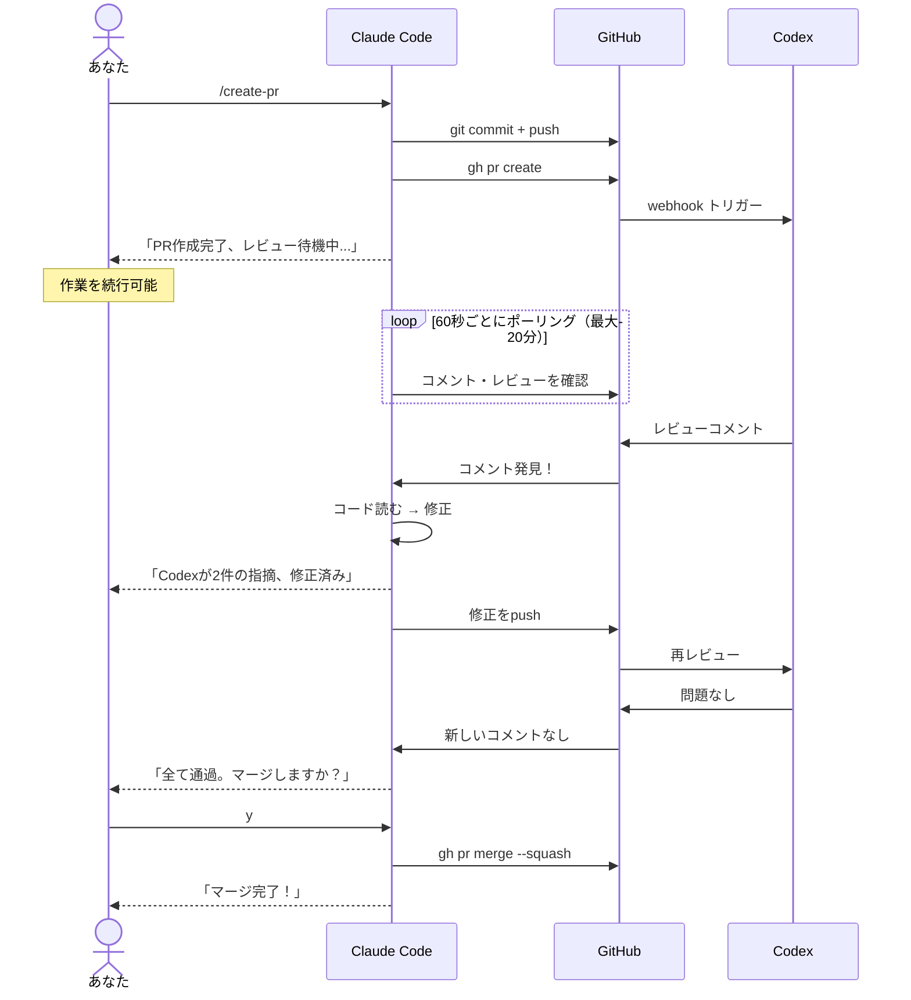
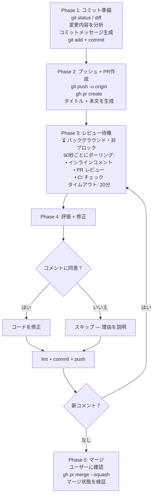

# create-pr-codex-review

[English](README.md) | **[日本語](README.ja.md)** | [中文](README.zh.md)

---

**OpenAI Codex** をAIコードレビュアーとして活用し、PRライフサイクルを完全自動化する Claude Code スキルです。

1コマンドで: コミット、プッシュ、PR作成、Codexレビュー待機、修正、マージ。

## インストール

```bash
npx skills add zytakeshi/create-pr-codex-review
```

グローバルインストール:

```bash
npx skills add zytakeshi/create-pr-codex-review -g
```

## 使い方

Claude Code で入力:

```
/create-pr                          # コミット、プッシュ、PR作成、レビュー待機
/create-pr and merge                # 同上 + レビュー通過後に自動マージ
/create-pr fix: update auth service # カスタムコミットメッセージ付き
```

## 前提条件

- [Claude Code](https://claude.ai/code) インストール済み
- [GitHub CLI](https://cli.github.com/) (`gh`) インストール・認証済み
- リポジトリで [Codex レビュー](#codex-レビューの有効化) を有効化

## 仕組み



### フェーズ別フロー



## Codex レビューの有効化

1. [chatgpt.com/codex](https://chatgpt.com/codex) を開き、GitHub アカウントを接続
2. [chatgpt.com/codex/settings/code-review](https://chatgpt.com/codex/settings/code-review) を開く
3. 対象リポジトリの **Code review** をオンにする
4. **Automatic reviews** をオンにすると、新しい PR ごとに自動レビューされる

有効化後、PR が作成されるたびに Codex がインラインコメントで自動レビューします。

**手動トリガー:** PR コメントに `@codex review` と入力
**重点レビュー:** PR コメントに `@codex review for security regressions` と入力
**Codex に修正させる:** PR コメントに `@codex address that feedback` と入力

**ヒント:** リポジトリのルートに `AGENTS.md` を追加して、レビュー基準をカスタマイズできます。

> ChatGPT Plus、Pro、Team、Enterprise のいずれかが必要です。

## FAQ

**Q: どのリポジトリに対応していますか？**
A: push 権限のある任意の GitHub リポジトリで使えます。

**Q: コミットメッセージのスタイルをカスタマイズできますか？**
A: はい。スキルは `git log` を分析して既存の規約に従います。

## ライセンス

MIT
