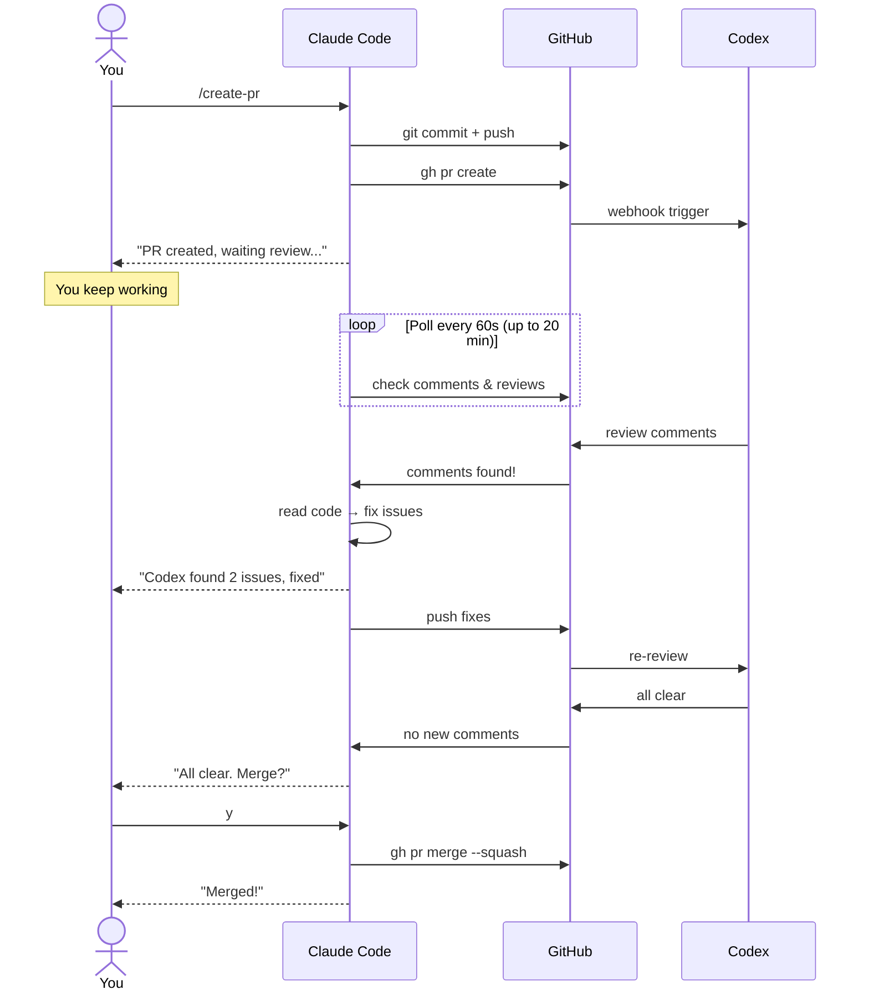
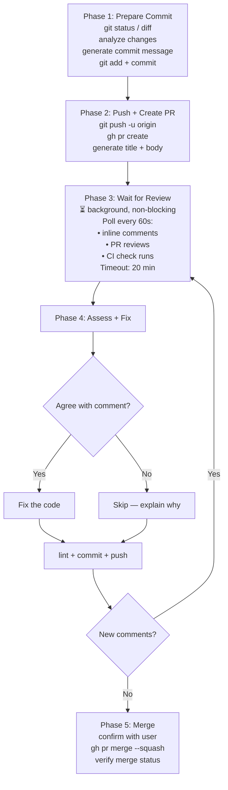

# create-pr-codex-review

**[English](README.md)** | [日本語](README.ja.md) | [中文](README.zh.md)

---

A Claude Code skill that automates the full pull request lifecycle with **OpenAI Codex** as your AI code reviewer.

One command: commit, push, create PR, wait for Codex review, fix issues, merge.

## Install

```bash
npx skills add zytakeshi/create-pr-codex-review
```

Or install globally:

```bash
npx skills add zytakeshi/create-pr-codex-review -g
```

## Usage

In Claude Code:

```
/create-pr                          # commit, push, create PR, wait for review
/create-pr and merge                # same + auto-merge after review passes
/create-pr fix: update auth service # with a custom commit hint
```

## Prerequisites

- [Claude Code](https://claude.ai/code) installed
- [GitHub CLI](https://cli.github.com/) (`gh`) installed and authenticated
- [Codex review](#enable-codex-review) enabled on your repo

## How It Works



### Phase-by-Phase Flow



## Enable Codex Review

1. Go to [chatgpt.com/codex](https://chatgpt.com/codex) and connect your GitHub account
2. Open [chatgpt.com/codex/settings/code-review](https://chatgpt.com/codex/settings/code-review)
3. Toggle on **Code review** for your repository
4. Toggle on **Automatic reviews** to review every new PR automatically

Once enabled, Codex posts a standard GitHub code review with inline comments whenever a PR is opened.

**Manual trigger:** Comment `@codex review` on any PR
**Focused review:** Comment `@codex review for security regressions`
**Let Codex fix:** Comment `@codex address that feedback`

**Tip:** Add review guidelines to `AGENTS.md` at your repo root to customize what Codex looks for.

> Requires ChatGPT Plus, Pro, Team, or Enterprise.

## FAQ

**Q: What repos are supported?**
A: Any GitHub repo you have push access to.

**Q: Can I customize the commit message style?**
A: Yes — the skill analyzes your recent `git log` and follows your existing conventions.

## License

MIT
