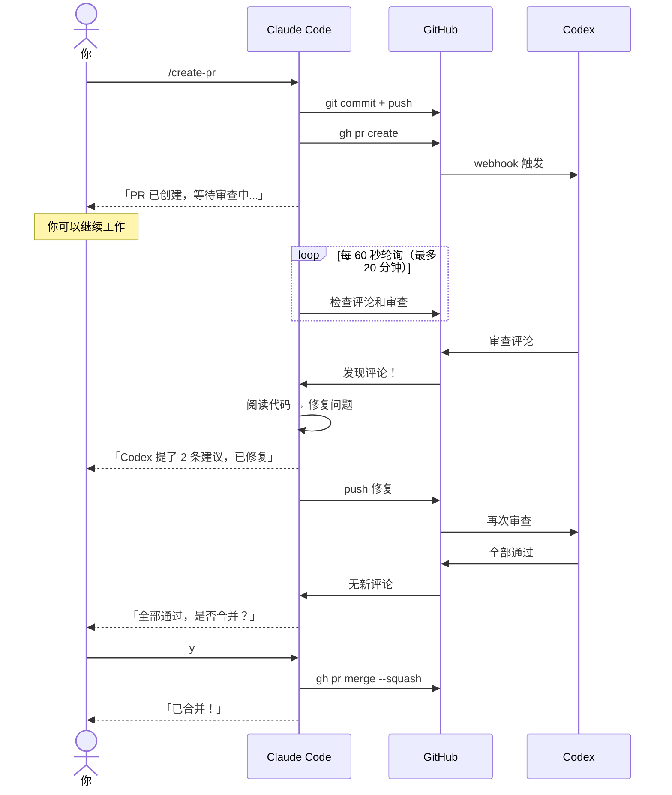
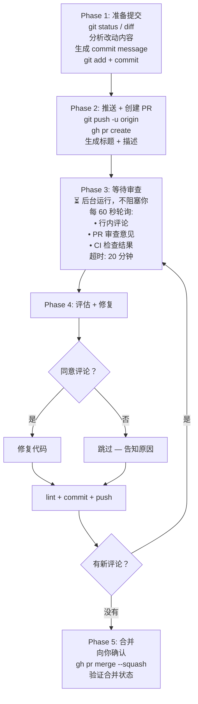

# create-pr-codex-review

[English](README.md) | [日本語](README.ja.md) | **[中文](README.zh.md)**

---

一个 Claude Code 技能，利用 **OpenAI Codex** 作为 AI 代码审查员，自动化完整的 PR 生命周期。

一条命令搞定：提交、推送、创建 PR、等待 Codex 审查、修复问题、合并。

## 安装

```bash
npx skills add zytakeshi/create-pr-codex-review
```

全局安装：

```bash
npx skills add zytakeshi/create-pr-codex-review -g
```

## 使用方法

在 Claude Code 中输入：

```
/create-pr                          # 提交、推送、创建 PR、等待审查
/create-pr and merge                # 同上 + 审查通过后自动合并
/create-pr fix: update auth service # 附带自定义提交信息
```

## 前提条件

- 已安装 [Claude Code](https://claude.ai/code)
- 已安装并认证 [GitHub CLI](https://cli.github.com/) (`gh`)
- 仓库已启用 [Codex 审查](#启用-codex-审查)

## 工作原理



### 分阶段流程



## 启用 Codex 审查

1. 打开 [chatgpt.com/codex](https://chatgpt.com/codex)，连接你的 GitHub 账号
2. 打开 [chatgpt.com/codex/settings/code-review](https://chatgpt.com/codex/settings/code-review)
3. 为目标仓库开启 **Code review**
4. 开启 **Automatic reviews**，新 PR 创建时自动触发审查

启用后，每次创建 PR，Codex 会自动以行内评论的形式进行代码审查。

**手动触发：** 在 PR 评论中输入 `@codex review`
**重点审查：** 在 PR 评论中输入 `@codex review for security regressions`
**让 Codex 修复：** 在 PR 评论中输入 `@codex address that feedback`

**提示：** 在仓库根目录添加 `AGENTS.md` 文件可以自定义审查标准。

> 需要 ChatGPT Plus、Pro、Team 或 Enterprise 订阅。

## 常见问题

**Q: 支持哪些仓库？**
A: 任何你有 push 权限的 GitHub 仓库。

**Q: 可以自定义 commit message 风格吗？**
A: 可以。技能会分析 `git log`，自动遵循你现有的提交规范。

## 许可证

MIT
